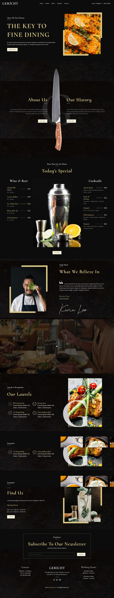

# :closed_book: Gericht Restaurant

### _Gericht Restaurant it is build with 💓 and react (Figma to Code) !!_

### Link :link: https://rak-gerichtrestaurant.netlify.app/
### Link :link: <a href="https://www.figma.com/design/Ntmv6mxVNtG7W26j0MTahb/Gericht-%7C-Best-Free-WordPress-theme-for-Restaurant-(Community)?node-id=8-2&node-type=canvas&t=A7An5rYMdZfe0OxK-0" target="_blank">Figma Design</a>

## Interface

## Run Locally

  - Run This command `https://github.com/developer-rak/gerich_restaurant.git`
  - You are now in the dev environment and you can play around

## ✨ Features

  - Home
  - About
  - Menu
  - Awards
  - Contact
  - LogIn
  - Register
  - Book Table

## ⚙️ Tech Stack
  - HTML5
  - CSS
  - React
  - react-icons
  - Netlify
